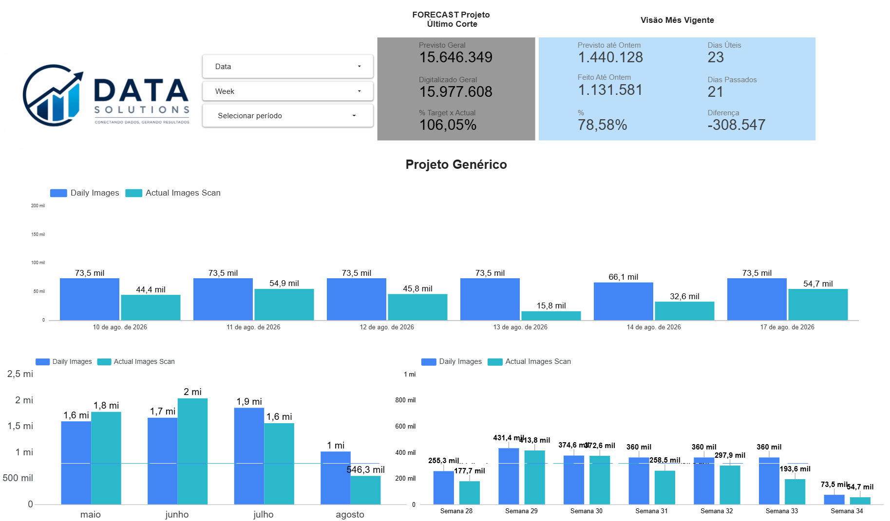

#  Dashboard Operacional BI

Dashboard desenvolvido para análise e acompanhamento de indicadores
operacionais, metas e produtividade.

##  Sobre o projeto

Este projeto apresenta um dashboard desenvolvido para transformar
dados operacionais em informações visuais que facilitem o
acompanhamento de desempenho e a tomada de decisão.

Os dados utilizados neste projeto são fictícios e foram criados
exclusivamente para fins de estudo e portfólio.

##  Objetivo

O objetivo do dashboard é permitir o acompanhamento de:

- Metas projetadas
- Produção realizada
- Atingimento da meta
- Produtividade diária
- Produtividade mensal
- Produtividade semanal
- Comparativo entre planejado e realizado
- Evolução dos indicadores ao longo do tempo

##  Indicadores

O dashboard apresenta indicadores como:

- Forecast / previsão
- Produção total
- Produção realizada
- Percentual de atingimento da meta
- Dias úteis
- Dias passados
- Diferença entre o planejado e o realizado

##  Tecnologias utilizadas

- Looker Studio
- Google Sheets
- Google Workspace

## 📈 Dashboard

##  Análises

Através do dashboard é possível analisar a evolução da produção em
diferentes períodos, comparar os resultados com as metas estabelecidas
e identificar possíveis desvios de produtividade.

##  Aprendizados

Este projeto foi desenvolvido para praticar:

- Organização e tratamento de dados
- Criação de indicadores
- Construção de dashboards
- Visualização de dados
- Análise de desempenho
- Transformação de dados em informações para tomada de decisão

##  Observação

Todos os dados apresentados neste projeto são fictícios e não
representam informações de nenhuma empresa ou operação real.
